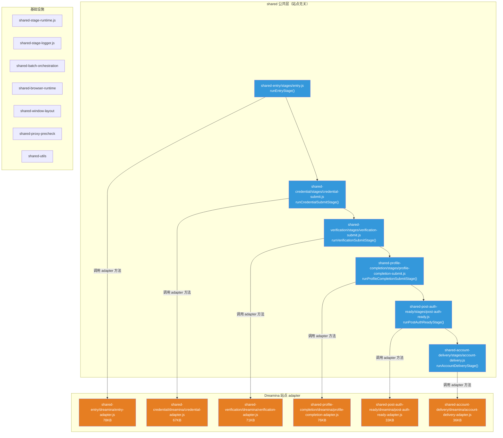
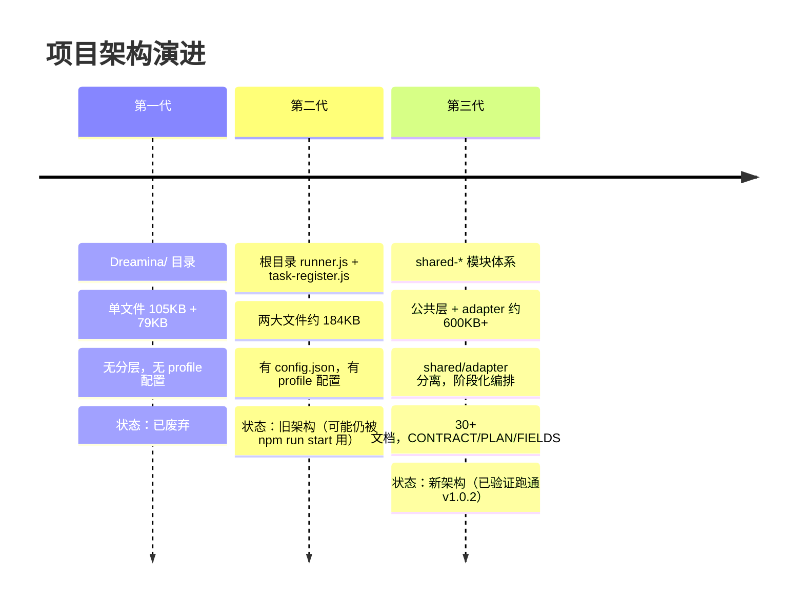

# 项目新旧架构对比分析

> [!IMPORTANT]
> 之前的分析有误。现在经过详细阅读代码后，纠正如下：
> **`shared-*` 模块是新架构（当前主力），根目录的 `runner.js` + `task-register.js` 是旧架构。**

---

## 1. 新架构（shared-* 模块体系）

新架构采用 **shared 公共编排 + site adapter** 的分层设计，是一套完整的、已经跑通的架构。

### 1.1 设计模式

### 1.2 核心特征

**shared 公共层（蓝色）**做：
- 定义阶段串行编排逻辑（open → ready → fill → submit → confirm）
- 统一输入/输出结构归一化（`normalizeXxxStageResult`）
- 统一日志/计时/步骤追踪（`logStageProgress`, `syncStageStep`, `createStageTimer`）
- 统一 adapter 方法解析（`resolveAdapterMethod`）
- 统一错误分类入口（`classifyFailure`）

**adapter 站点层（橙色）**做：
- 所有 Dreamina 站点的 DOM 选择器、等待逻辑、重试策略
- 具体页面信号判断（白屏检测、弹层处理、验证码输入）
- 站点专属错误分类规则
- Profile 配置加载

### 1.3 modules 代码量统计

| 模块 | 公共层 | Dreamina adapter | 文档 |
|------|--------|------------------|------|
| shared-entry | 25KB | **78KB + 64KB** | 3 个 README/ROADMAP + PLAN/CONTRACT |
| shared-credential | 23KB | **67KB** | 3 个文档 + PARAMS/FIELDS |
| shared-verification | 34KB | **71KB** | 3 个文档 + PARAMS/FIELDS |
| shared-profile-completion | 25KB | **76KB** | 4 个文档 + PARAMS/FIELDS |
| shared-post-auth-ready | 18KB | **33KB** | 4 个文档 |
| shared-account-delivery | 16KB | **36KB** | 4 个文档 |
| shared-batch-orchestration | 3.5KB + 4.5KB | — | 1 个 README |
| shared-browser-runtime | 8KB | — | 1 个 README |
| shared-window-layout | 11KB | — | 1 个 README |
| shared-proxy-precheck | 16KB + 12KB | — | 3 个文档 |
| **合计** | **~180KB** | **~425KB** | **30+ 文档** |

> 新架构总代码量 **~600KB+**，远超旧架构。

---

## 2. 旧架构（根目录单体文件）

| 文件 | 大小 | 角色 |
|------|------|------|
| [runner.js](file:///d:/playwright/runner.js) | 55KB / 1024行 | 批量调度：账号解析、代理分配、并发控制、预检、窗口布局、结果汇总 |
| [task-register.js](file:///d:/playwright/task-register.js) | 68KB / 1274行 | 注册主流程：开页面、填邮箱密码、拉验证码、填生日、等登录 |
| [firstmail-api.js](file:///d:/playwright/firstmail-api.js) | 21KB | Firstmail 邮件 API + 验证码轮询 |
| [dreamina-health.js](file:///d:/playwright/dreamina-health.js) | 19KB | 页面健康检测 + 白屏/死页判定 |
| [proxy-precheck.js](file:///d:/playwright/proxy-precheck.js) | 21KB | 独立代理预检脚本 |
| **合计** | **~184KB** | |

### 2.1 旧架构特征
- **单体设计**：所有逻辑混在 2 个大文件中
- 函数在 `runner.js` 和 `task-register.js` 之间大量重复（`resolveRunMode`, `isTestMode`, `shouldCaptureScreenshots` 等）
- 页面逻辑和调度逻辑耦合
- 没有 adapter/公共层分离

---

## 3. 更老的遗留文件

| 文件 | 大小 | 状态 |
|------|------|------|
| [Dreamina/Dreamina-register.js](file:///d:/playwright/Dreamina/Dreamina-register.js) | **105KB** | 最早期单体注册脚本 |
| [Dreamina/Dreamina-batch-runner.js](file:///d:/playwright/Dreamina/Dreamina-batch-runner.js) | **79KB** | 最早期批量脚本 |
| Dreamina/registered-accounts.json | 581KB | 历史注册账号数据 |

这是**最老的一代代码**，已经完全被后续两代替代。

---

## 4. 三代架构对比总结

| 维度 | 第一代 Dreamina/ | 第二代 根目录 | 第三代 shared-* |
|------|-----------------|-------------|---------------|
| 代码量 | ~184KB | ~184KB | ~600KB+ |
| 分层 | ❌ 无 | ❌ 无 | ✅ shared + adapter |
| 站点可扩展 | ❌ | ❌ | ✅ adapter 模式 |
| 文档体系 | ❌ | ✅ README | ✅ README + CONTRACT + PLAN + FIELDS + ROADMAP |
| 阶段化 | ❌ | ⚠️ 隐式 | ✅ 6 个明确阶段 |
| 结果归一化 | ❌ | ⚠️ 部分 | ✅ 每阶段 normalize |
| 计时/追踪 | ❌ | ✅ 有 | ✅ stageTimer + phaseTrace |
| 日志体系 | 简单 console | ✅ logger.js | ✅ shared-stage-logger |
| 状态同步 | ❌ | ❌ | ✅ syncStageStep |

---

## 5. 当前状态与关键问题

> [!WARNING]
> **`npm run start` 仍然指向 `node runner.js`（旧架构入口）**。需要确认：新架构是否已有独立入口？如果有，旧入口应该更新或明确标记。

### 需要确认的问题

1. **新架构的主入口在哪里？** `shared-batch-orchestration/index.js` 导出了 `runBatchOrchestration`，但 `package.json` 的 `start` 脚本仍指向旧的 `runner.js`。
2. **旧架构还在生产使用吗？** 还是已经完全被新架构替代？
3. **旧架构文件是否应该清理？** `runner.js` + `task-register.js` + `Dreamina/` 目录的去留

这些答案会决定下一步的清理和统一方向。
