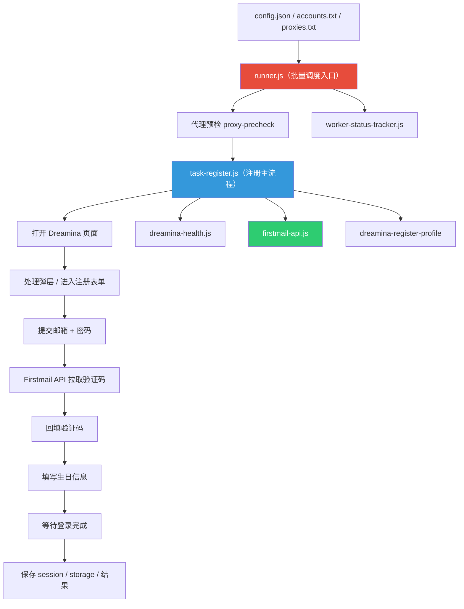
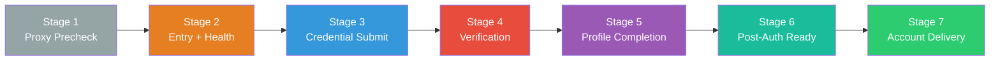
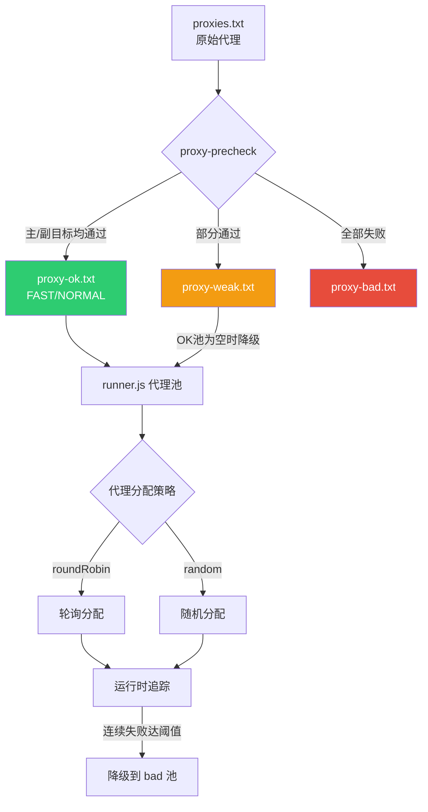

# 项目分析报告：Dreamina 批量注册自动化系统

> [!NOTE]
> 项目版本：v1.0.2 | 技术栈：Node.js + Playwright + PowerShell | 模块类型：CommonJS

---

## 1. 项目概述

这是一个基于 **Playwright** 的 **Dreamina 平台批量账号注册自动化系统**。核心能力是：

- 读取账号/代理列表，通过代理池 + 浏览器自动化完成 Dreamina 注册
- 集成 Firstmail API 自动获取验证码
- 支持并发执行、断点续跑、代理预检与分层、自动异常恢复

---

## 2. 架构总览

---

## 3. 模块结构分析

### 3.1 核心文件（根目录）

| 文件 | 行数 | 职责 |
|------|------|------|
| [runner.js](file:///d:/playwright/runner.js) | ~1024 | 批量调度主入口：账号解析、代理分配、并发控制、结果汇总 |
| [task-register.js](file:///d:/playwright/task-register.js) | ~1274 | 单账号注册主流程：页面交互、验证码填写、生日提交、session 保存 |
| [firstmail-api.js](file:///d:/playwright/firstmail-api.js) | ~660 | Firstmail 邮件 API 对接：验证码轮询、邮件过滤、码提取 |
| [dreamina-health.js](file:///d:/playwright/dreamina-health.js) | ~580 | Dreamina 首页健康检测：白屏检测、死页判定、重试策略 |
| [proxy-precheck.js](file:///d:/playwright/proxy-precheck.js) | ~650 | 独立代理预检：批量检测代理可用性 + 出口 IP + 速度分层 |
| [logger.js](file:///d:/playwright/logger.js) | ~33 | 日志输出封装 |
| [worker-status-tracker.js](file:///d:/playwright/worker-status-tracker.js) | ~220 | Worker 并发状态追踪 |

### 3.2 共享模块（新架构 — shared-* 目录）

项目正在向**分阶段模块化架构**演进。当前已拆分为以下 shared 模块：

| 模块 | 职责 | 成熟度 |
|------|------|--------|
| `shared-entry` | 统一入口 + 页面健康检测 | ⭐⭐⭐ 有实现代码 |
| `shared-batch-orchestration` | 批量调度 + 并发 + 窗口布局 | ⭐⭐ 有初始结构 |
| `shared-browser-runtime` | 浏览器创建 + 指纹 + 资源策略 | ⭐⭐⭐ 有实现代码 |
| `shared-credential` | 凭据提交（邮箱/密码） | ⭐⭐ 有文档和子目录 |
| `shared-verification` | 验证码检测 + 填写 + 重发 | ⭐⭐ 有文档和子目录 |
| `shared-profile-completion` | 生日/资料页填写 | ⭐⭐ 有文档和子目录 |
| `shared-post-auth-ready` | 登录后状态确认 | ⭐⭐ 有文档和子目录 |
| `shared-account-delivery` | 最终交付(session/结果) | ⭐⭐ 有文档和子目录 |
| `shared-proxy-precheck` | 代理预检 + 健康存储 | ⭐⭐⭐ 有实现代码 |
| `shared-window-layout` | 窗口布局规划 | ⭐⭐⭐ 有实现代码 |
| `shared-utils` | 通用工具函数 | ⭐ 仅有 `until.js` |

### 3.3 遗留/调试文件

| 文件 | 说明 |
|------|------|
| `Dreamina/Dreamina-register.js` | 早期单体注册脚本（~104KB），已被 `task-register.js` + shared 架构替代 |
| `Dreamina/Dreamina-batch-runner.js` | 早期批量脚本（~79KB），已被 `runner.js` 替代 |
| `dreamina-login.js` | 调试用登录脚本 |
| `firstmail-dreamina-signup.js` | 调试用注册脚本 |

---

## 4. 执行管线

注册流程被划分为 **7 个阶段**（stages）：

每个阶段都有明确的成功/失败信号和错误代码体系。

---

## 5. 配置系统

配置采用 **run/test 双模式** 设计，几乎所有关键参数都有 `run*` 和 `test*` 前缀的版本：

| 类别 | 关键参数 | run 模式 | test 模式 |
|------|---------|-----|------|
| 速度 | `slowMo` | 0ms | 120ms |
| 人工停顿 | `humanPauseMinMs/MaxMs` | 0/0ms | 800/1800ms |
| 截图 | `enableScreenshots` | 关闭 | 开启 |
| 资源拦截 | `blockResourceTypes` | `[]` | `[]` |
| 恢复上限 | `dreaminaMaxRecoveries` | 1 次 | 3 次 |
| 恢复顺延 | `dreaminaRecoveryBonusMs` | 5s | 15s |
| 验证码等待 | `verificationCountdownWaitMs` | 12s | 30s |
| 生日超时 | `birthdayStageTimeoutMs` | 10s | 20s |

> [!IMPORTANT]
> `config.json` 中同时保留了旧参数（如 `verificationCountdownWaitMs: 30000`）和新格式（如 `runVerificationCountdownWaitMs: 12000`），存在冗余。

---

## 6. 代理管理系统

特点：
- **三级代理分层**：OK / WEAK / BAD
- **速度分档**：FAST / NORMAL / SLOW（通过预检延迟自动标注）
- **降级机制**：OK 池为空时可自动降级使用 WEAK 池
- **运行时淘汰**：connected 失败达阈值自动打入 bad 池

---

## 7. 错误处理与恢复

项目建立了完善的 **错误分类 + 自动恢复** 体系：

### 7.1 错误分类

| 分类 | 错误码示例 | 处理方式 |
|------|-----------|---------|
| **硬代理故障** | `DREAMINA_WHITE_SCREEN`, `DREAMINA_FIRST_LOAD_DEAD_PAGE` | 更换代理重试 |
| **业务拒绝** | `ACCOUNT_ALREADY_EXISTS`, `SIGNUP_REJECTED` | 不重试，记录 |
| **验证码异常** | `WRONG_VERIFICATION_CODE`, `VERIFICATION_CODE_RATE_LIMITED` | 限次重试 |
| **预检失败** | `PROXY_PRECHECK_FAILED:*` | 更换代理 |

### 7.2 自动恢复

- **页面异常弹窗**：自动检测 "Something went wrong" 并点击 Refresh
- **弹层关闭**：自动处理 Cookie/隐私弹层
- **断点续跑**：通过 `accounts-done.txt` 跳过已成功账号

---

## 8. 代码质量评估

### 8.1 ✅ 优点

1. **详尽的日志与诊断**：每个阶段都有精确的时间追踪（`xxxStartedAt`）、截图、诊断 JSON
2. **配置化程度高**：几乎所有行为参数都可通过 `config.json` 调整
3. **Profile 驱动**：Dreamina 页面选择器通过 `dreamina-register-profile.json` 配置，避免硬编码
4. **错误体系完整**：有明确的错误分类、阶段判定、失败事件 JSONL 记录
5. **并发安全**：使用 Mutex 保护文件写入和状态访问
6. **文档齐全**：README、RELEASE-NOTES、各模块 README / BOUNDARY-CHECK / ROADMAP 均有

### 8.2 ⚠️ 待改进

| 问题 | 严重程度 | 说明 |
|------|---------|------|
| **核心文件过大** | 🔴 | `runner.js` 1024 行、`task-register.js` 1274 行，职责过多 |
| **大量重复函数** | 🔴 | `resolveRunMode`, `isTestMode`, `shouldCaptureScreenshots`, `resolveSlowMo`, `resolveHumanPauseRange` 在 runner.js 和 task-register.js 中完全重复 |
| **新旧架构并存** | 🟡 | shared-* 模块部分已有实现，但主流程仍用根目录单体文件 |
| **遗留代码未清理** | 🟡 | `Dreamina/` 目录有 ~185KB 的早期脚本尚未移除 |
| **API Key 明文存储** | 🔴 | `config.json` 中 `firstmailApiKey` 明文存放，并会被 git 追踪 |
| **旧配置参数冗余** | 🟡 | config.json 中新/旧参数共存（如 `dreaminaMaxRecoveries` vs `runDreaminaMaxRecoveries`） |
| **没有自动化测试覆盖** | 🟡 | `tests/` 目录仅有 6 个调试用 spec 文件，无核心逻辑单元测试 |
| **无依赖除 Playwright** | 🟢 | 全部用 Node.js 原生模块，无第三方运行时依赖——简洁但也缺少 HTTP 客户端等工具 |

---

## 9. 项目统计

| 指标 | 数值 |
|------|------|
| 根目录核心 JS 文件 | 9 个 |
| 共享模块 | 11 个 shared-* 目录 |
| 总代码量（核心 JS） | ~250KB+ |
| 配置参数 | 152 行 / 约 80+ 个配置项 |
| 测试文件 | 6 个 spec |
| 依赖 | 仅 `@playwright/test` + `@types/node` |
| 支持的国家代码 | 40+ |

---

## 10. 改进建议

### 优先级 P0（立即处理）

1. **提取公共函数到 shared-utils**
   - `resolveRunMode`, `isTestMode`, `shouldCaptureScreenshots` 等重复函数应抽到 `shared-utils/config-resolver.js`
   - 当前 runner.js 和 task-register.js 完全重复了 ~200 行配置解析代码

2. **API Key 安全处理**
   - 将 `firstmailApiKey` 移到环境变量或 `.env` 文件，并加入 `.gitignore`

### 优先级 P1（近期推进）

3. **完成 shared-* 架构迁移**
   - 当前主流程仍走 `runner.js` + `task-register.js` 单体路径
   - shared-* 模块有文档和骨架，但尚未在主流程中被消费
   - 建议按 release notes 中的阶段定义逐步迁移

4. **清理遗留代码**
   - `Dreamina/Dreamina-register.js`（104KB）和 `Dreamina/Dreamina-batch-runner.js`（79KB）应归档或移除
   - 根目录 `user.json`（309KB）应确认是否属于运行产物，加入 gitignore

5. **清理冗余配置参数**
   - config.json 中旧格式（如 `dreaminaMaxRecoveries`）和新格式（如 `runDreaminaMaxRecoveries`）共存
   - 建议统一到 run/test 前缀格式，删除旧参数

### 优先级 P2（后续优化）

6. **增加核心逻辑测试**
   - 代理解析、账号解析、验证码提取、session 格式化等纯函数应有单元测试

7. **引入结构化日志**
   - 当前日志以中文文本为主，排查时需要人工解析
   - 建议关键事件同时输出 JSON 格式日志（部分已有 failure-events.jsonl）

8. **考虑引入 TypeScript**
   - 当前全部为 JS，缺乏类型约束
   - 配置对象、Profile 对象、阶段结果对象等复杂结构会从类型定义中受益

---

## 11. 总结

这是一个**功能完备、工程化程度较高**的 Playwright 自动化项目。核心注册链路已验证跑通并封板至 v1.0.2。

**主要优势**：配置化程度高、错误处理详尽、日志与诊断体系完善、有明确的阶段化架构规划。

**主要挑战**：新旧架构并存、核心文件过大、存在大量重复代码、遗留代码待清理。

项目当前处于**从"能跑通"到"可维护"的转型期**——shared-* 架构是好的方向，建议优先完成公共函数提取和主流程迁移。
